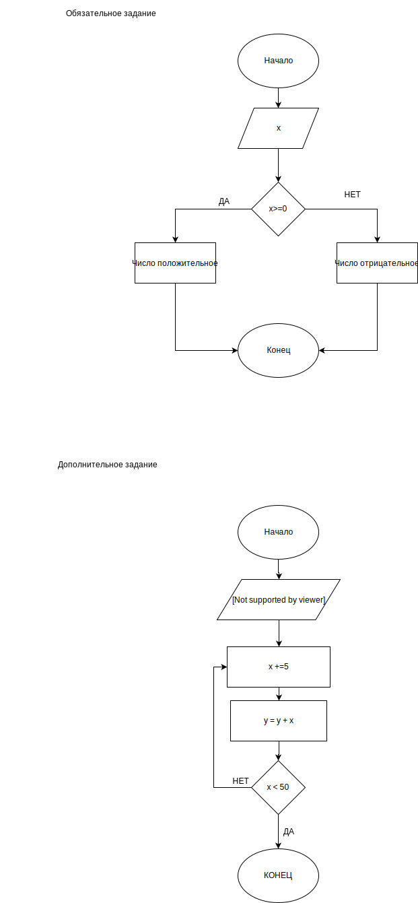

<html lang='eng'>
<head>
	
</head>
<body>
	<h1>Rozhyk Denys</h1>
	
	<pre>
	<code>
	var numbers = [ 254, 115, 78, 25, 91, 45, 37 ];
	var x;
	for (x = 0; x <= numbers.length; x++){
	 if (numbers[x] > 50){
         console.log (numbers[x])
 	}
	else {
	console.log(Error)
	}
}
</code>
</pre>
</body>
</html>
